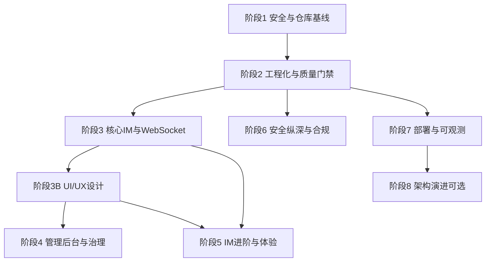
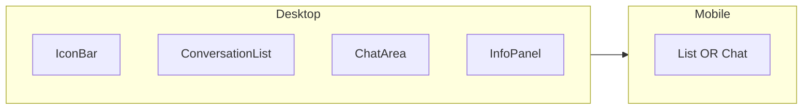

# WeChat Web 全量改进总路线图

本计划为**唯一完整清单**，合并原四阶段路线图 + 补充清单，去重后按依赖排序。实施时**不要编辑**原 plan 文件；以本计划 todos 为进度来源。

---

## 总览架构

---

## 阶段 1：安全与仓库基线（阻塞上线，约 2–3 天）

### 1.1 认证与权限

| # | 任务 | 关键文件 |
|---|------|----------|
| 1.1.1 | `User.role`：`user` / `admin`；迁移；`username=admin` 种子为 admin | [backend/models.py](backend/models.py) |
| 1.1.2 | `/api/admin/stats`、`/api/admin/users`：`@jwt_required` + `admin_required` | [backend/routes.py](backend/routes.py) |
| 1.1.3 | 删除 [admin.js](frontend/js/admin.js) 硬编码 `qwerty`；`/api/auth/login` + `sessionStorage` + Bearer | [frontend/js/admin.js](frontend/js/admin.js) |
| 1.1.4 | `require_conversation_member()` 装饰器/辅助函数 | 新建 `backend/auth_utils.py` 或 routes |
| 1.1.5 | 成员校验：`GET/POST .../messages`、`POST /files/upload`、WS `send_message` | routes + [websocket_handler.py](backend/websocket_handler.py) |
| 1.1.6 | `download_file`：JWT + 会话成员；头像归属校验或独立路由 | routes |
| 1.1.7 | 上传：MIME + 扩展名白名单；禁止 `.exe` 等 | routes |
| 1.1.8 | `.env.example`；`ProductionConfig` 无密钥则启动失败 | [backend/config.py](backend/config.py) |
| 1.1.9 | CORS / SocketIO origins 从 `ALLOWED_ORIGINS` 读取，去掉 `*` | config + [app.py](backend/app.py) |
| 1.1.10 | JWT 访问令牌 7 天；预留 refresh（阶段 6 实现） | config |
| 1.1.11 | API 响应统一 `{ code, message, data }`；`logging` 替代 `print` | routes |

### 1.2 仓库与配置

| # | 任务 |
|---|------|
| 1.2.1 | 根目录 [.gitignore](.gitignore)：`__pycache__`、`*.db`、`instance/`、`uploads/*`、`!.gitkeep`、`.env`、`.idea/` |
| 1.2.2 | `git rm --cached` 已跟踪 db/pycache/uploads/.idea |
| 1.2.3 | DB 统一 `instance/wechat.db` |
| 1.2.4 | `backend/requirement.txt` → 根目录 [requirements.txt](requirements.txt) + flask-migrate、pytest、ruff |
| 1.2.5 | 删除仓库内 [checkhtml/.idea](checkhtml/.idea) |
| 1.2.6 | [frontend/js/config.js](frontend/js/config.js)：`API_BASE_URL` / `WS_URL`（替代 localhost 硬编码） |

### 1.3 P0 缺陷修复（并入阶段 1）

| # | 任务 | 关键文件 |
|---|------|----------|
| 1.3.1 | 修复 `create_private_conversation` 查重（恰好 2 成员且为指定两人） | [backend/database.py](backend/database.py) |
| 1.3.2 | [api.js](frontend/js/api.js)：`AbortController` 超时；401 统一登出/跳转 | frontend/js/api.js |
| 1.3.3 | 本地默认头像 SVG，替换 `via.placeholder.com` | models、index.html、ui.js |
| 1.3.4 | 登录/注册 Flask-Limiter 限流 | routes + requirements |

---

## 阶段 2：工程化与质量门禁（约 4–5 天）

| # | 任务 |
|---|------|
| 2.1 | Flask-Migrate 初始化；初始迁移（含 `role`、索引） |
| 2.2 | 弃用手写 [migrate_add_is_edited.py](backend/migrate_add_is_edited.py) |
| 2.3 | `tests/`：pytest-flask — 注册/登录、admin 403、成员 403、消息 CRUD、文件下载权限 |
| 2.4 | 收敛 [test_api.py](test_api.py)、[login_check.py](login_check.py)、[check_users.py](check_users.py) → `tests/` 或 `scripts/` |
| 2.5 | 补全 [README.md](README.md)：安装、环境变量、架构图、默认账号 |
| 2.6 | [scripts/dev.ps1](scripts/dev.ps1) 一键启动 |
| 2.7 | [.github/workflows/ci.yml](.github/workflows/ci.yml)：ruff + pytest + 禁止 `*.db` 入仓 |
| 2.8 | pre-commit：ruff + db 检查 |
| 2.9 | `LICENSE`、`CONTRIBUTING.md` |
| 2.10 | Playwright E2E（可选本阶段末）：双用户发消息 |
| 2.11 | 移除 [models.py](backend/models.py) 无用 `jwt`/`wraps`；WS 用 `flask_jwt_extended` 解码 |

---

## 阶段 3：核心 IM 与 WebSocket（约 4–5 天）

| # | 任务 | 关键文件 |
|---|------|----------|
| 3.1 | `Conversation.to_dict` 未读统一 `get_unread_count` | models + database |
| 3.2 | 前端会话列表未读角标 | ui.js、styles.css |
| 3.3 | `POST .../messages` 成功后 WS 广播（复用 emit 辅助函数） | routes + websocket_handler |
| 3.4 | 前端 typing debounce → WS `typing` | app.js |
| 3.5 | 前端 WS 心跳 `ping`/`pong` | websocket.js |
| 3.6 | `online_users`: `user_id → Set[sid]`；断开仅最后 sid 离线 | websocket_handler |
| 3.7 | 连接后按用户会话 `join_room` | websocket_handler |
| 3.8 | `POST /api/auth/logout` 设 offline；前端调用 | routes + app.js |
| 3.9 | 群 `update_group` 实现 name/avatar；群主权限踢人/改资料 | routes + database |
| 3.10 | 好友申请：`friend_requests` 表 + 同意/拒绝 API（替代直接 add） | models + routes |
| 3.11 | 图片/文件消息气泡 UI（缩略图、下载） | ui.js + app.js |
| 3.12 | 消息历史上拉分页（offset） | app.js + api.js |
| 3.13 | 乐观发送（`sending` / `failed` 状态） | app.js + ui.js |
| 3.14 | 增量同步 `GET /messages?since=` 断线重连 | routes + app.js |

---

## 阶段 3B：UI/UX 设计改进（约 5–8 天，与阶段 3 并行或紧随其后）

**目标：** 在功能补齐的同时，把仿微信界面从「可用」提升到「一致、清晰、可访问、移动端友好」。主要改动文件：[frontend/css/styles.css](frontend/css/styles.css)、[frontend/css/tokens.css](frontend/css/tokens.css)（新建）、[frontend/js/ui.js](frontend/js/ui.js)、[frontend/index.html](frontend/index.html)、[frontend/css/admin.css](frontend/css/admin.css)。

### 3B.1 设计系统（Design Tokens）

| # | 任务 | 说明 |
|---|------|------|
| UX.1 | 新建 `tokens.css` CSS 变量 | 色板：主色 `#07c160`、背景层级、边框、文字 primary/secondary/muted；间距 4/8/12/16；圆角 4/8/12；阴影 1–3 级 |
| UX.2 | 合并 `styles.css` 重复块（约 1670 行后） | 单一来源，避免暗色/亮色两套冲突规则 |
| UX.3 | 字体与字号阶梯 | 12/14/16/18；行高 1.4–1.5；会话名/预览/时间层级清晰 |
| UX.4 | 组件类名规范 | `.btn`、`.input`、`.badge`、`.bubble`、`.list-item`；**移除** [ui.js](frontend/js/ui.js) 消息气泡大量 inline style，改 class |
| UX.5 | 主应用与管理端共用 tokens | [admin.css](frontend/css/admin.css) 引用同一变量，表格/卡片风格一致 |

### 3B.2 布局与响应式

| # | 任务 | 说明 |
|---|------|------|
| UX.6 | 桌面三栏 | 图标栏 60px + 会话列表 350px + 聊天区 `1fr` + 信息面板可折叠（已有结构，统一断点行为） |
| UX.7 | 平板 `≤1024px` | 默认隐藏信息面板；点击「会话信息」滑出 overlay |
| UX.8 | 手机 `≤768px` | **主导航模式**：仅显示会话列表 OR 聊天区；返回按钮；底部输入区 `safe-area-inset-bottom` |
| UX.9 | 会话列表全屏切换 | `selectConversation` 时移动端自动进入聊天视图，返回恢复列表 |
| UX.10 | 触摸目标 | 按钮/列表项最小 44×44px；输入区工具栏间距加大 |

### 3B.3 会话列表体验

| # | 任务 | 说明 |
|---|------|------|
| UX.11 | 未读角标视觉 | 红点/数字 caps `99+`；免打扰会话灰点（依赖 5.1 muted） |
| UX.12 | 在线状态 | 头像右下角绿点（`conversation.online`） |
| UX.13 | 置顶分区 | 「置顶」标题 + 分隔线（依赖 pinned） |
| UX.14 | 预览行 | 最后消息单行省略；群聊显示发送者前缀 `张三: ...` |
| UX.15 | 选中态 | 左侧色条 + 背景 `#f5f5f5`，对比当前仅 class `active` |
| UX.16 | 空状态 | 插图 +「暂无会话，点击 + 开始聊天」+ CTA |
| UX.17 | 搜索框 | 聚焦态边框、清除按钮、无结果提示 |
| UX.18 | 加载骨架屏 | 会话列表 6 条 skeleton，替代空白闪烁 |

### 3B.4 聊天区与消息气泡

| # | 任务 | 说明 |
|---|------|------|
| UX.19 | 气泡样式 | 自己：浅绿 `#95ec69`；对方：白底 + 细边框；统一 max-width 65%、圆角 4px 定向 |
| UX.20 | 日期分隔条 | 「今天 / 昨天 / MM月DD日」居中灰条，[ui.js](frontend/js/ui.js) 按 timestamp 分组插入 |
| UX.21 | 时间戳策略 | 同组消息仅最后一条显示时间；悬停显示精确时间 tooltip |
| UX.22 | 已读/发送状态 | 自己消息：时钟 icon → 单勾 → 双勾（对接 5.3）；`sending` 转圈、`failed` 红色重试 |
| UX.23 | 撤回样式 | 居中灰色系统提示条，替代气泡内 `[已撤回]` 纯文本 |
| UX.24 | 图片/文件气泡 | 缩略图圆角、点击 lightbox；文件卡片：图标+文件名+大小+下载 |
| UX.25 | 引用回复块 | 左侧竖线 + 灰底摘要（对接 5.4） |
| UX.26 | 消息操作 | 右键/长按菜单：复制、回复、转发、撤回（替代 `display:none` 悬停按钮） |
| UX.27 | 正在输入 | 替换 placeholder 头像；文案「对方正在输入...」+ 动画点 |
| UX.28 | 滚动行为 | 进入会话滚底；上拉加载时保持 scroll anchor；新消息在底部外时显示「N 条新消息」浮钮 |
| UX.29 | 输入区 | `textarea` 自动增高（max 4 行）；Enter 发送 / Shift+Enter 换行；发送按钮禁用态（空内容） |
| UX.30 | 表情按钮 | 对接 5.8 面板：底部 popover，点击插入光标位 |
| UX.31 | 连接状态条 | 顶部黄条：连接中 / 已断开 / 重连中，不遮挡聊天 |

### 3B.5 认证与模态框

| # | 任务 | 说明 |
|---|------|------|
| UX.32 | 登录/注册模态 | 品牌区（Logo+标语）；表单项 label 关联；错误信息字段下方红色文案 |
| UX.33 | 提交反馈 | 按钮 loading（spinner + 禁用）；防重复提交 |
| UX.34 | 密码可见切换 | 已有 checkbox，改为输入框右侧 icon toggle |
| UX.35 | 模态无障碍 | `role="dialog"`、`aria-modal`、打开时 focus trap、Esc 关闭 |
| UX.36 | 注册校验即时 | 用户名长度、密码一致，blur 时提示（不等提交） |

### 3B.6 反馈、空态与错误（Toast 已有基础）

| # | 任务 | 说明 |
|---|------|------|
| UX.37 | 统一 Toast 位置 | 右上堆叠；错误 4s、成功 2s（沿用 [ui.js](frontend/js/ui.js) `_createToast`） |
| UX.38 | 内联错误 | API 失败在输入区上方 banner，不仅 console |
| UX.39 | 全页错误 | 后端不可达：居中插画 + 重试按钮 |
| UX.40 | 上传进度 | 文件上传条或百分比在输入工具栏上方 |

### 3B.7 无障碍（a11y）

| # | 任务 | 说明 |
|---|------|------|
| UX.41 | 焦点环 | `:focus-visible` 2px 主色描边，不全站 `outline: none` |
| UX.42 | 会话列表键盘 | ↑↓ 切换会话，Enter 打开；`aria-selected` |
| UX.43 | 新消息播报 | `aria-live="polite"` 区域（可选仅屏幕阅读器） |
| UX.44 | 对比度 | 次要文字 `#666` 以上，满足 WCAG AA |
| UX.45 | `prefers-reduced-motion` | 关闭 typing 点动画、toast 滑入 |

### 3B.8 深色模式与主题（与 5.9 合并实施）

| # | 任务 | 说明 |
|---|------|------|
| UX.46 | `[data-theme=dark]` | 背景 `#1e1e1e`、气泡/侧栏适配；切换入口：个人菜单 |
| UX.47 | 跟随系统 | `prefers-color-scheme` 默认 + 手动覆盖 localStorage |
| UX.48 | 图片/头像 | 暗色下边框微调，避免与背景糊在一起 |

### 3B.9 管理后台 UI（对齐主应用）

| # | 任务 | 说明 |
|---|------|------|
| UX.49 | 侧栏导航 | 当前页高亮、图标+文字、折叠态（移动端） |
| UX.50 | 表格体验 | 斑马纹、行 hover、操作按钮 icon+文字、空数据插画 |
| UX.51 | 替换「开发中」占位 | `#messagesPage` / `#settingsPage` / `#reportsPage` 用统一 Empty 组件 |
| UX.52 | 仪表盘卡片 | 数字动画可选、sparkline 浅色背景 |

### 3B.10 微交互与性能感知

| # | 任务 | 说明 |
|---|------|------|
| UX.53 | 列表项过渡 | `transition: background 0.15s` |
| UX.54 | 发送瞬间 | 气泡淡入 + 轻微上移 4px |
| UX.55 | 头像懒加载 | `loading="lazy"` + 失败回退默认 SVG |
| UX.56 | 虚拟列表（可选 P2） | 消息 >500 条时用简单 windowing，防 DOM 卡顿 |

### 3B.11 聊天头部与会话信息面板

| # | 任务 | 说明 |
|---|------|------|
| UX.57 | 聊天头部重构 | 左：返回（移动端）+ 头像 + 名称 + 副标题（在线/最近上线）；右：搜索本聊、会话信息、更多菜单 |
| UX.58 | 副标题动态 | 在线绿字「在线」；离线显示 `last_seen` 相对时间（对接后端字段） |
| UX.59 | 信息面板 [#infoPanel](frontend/index.html) | 私聊：大头像、备注、清空记录、举报入口；群聊：群名、公告、成员列表滚动 |
| UX.60 | 面板动效 | 桌面右侧滑入；移动端全屏 sheet + 下滑关闭手势（可选） |
| UX.61 | 成员列表项 | 头像+昵称+在线点；群主标识 badge；点击发起私聊（若产品允许） |

### 3B.12 新建会话、联系人与搜索

| # | 任务 | 说明 |
|---|------|------|
| UX.62 | [#newChatModal](frontend/index.html) 重设计 | 标题、关闭钮、搜索防抖、结果列表卡片（头像/昵称/「已是好友」） |
| UX.63 | 联系人视图（可选） | CSS 已有 [`.sidebar-icon-bar`](frontend/css/styles.css) 但 HTML 未挂载：要么接入「聊天/联系人」Tab，要么删除死代码 |
| UX.64 | 联系人列表 UI | 字母索引或搜索；空态「添加好友」引导 |
| UX.65 | 会话内搜索 | 头部搜索 icon 打开侧栏：按关键词高亮消息（对接 5.7 前可做 UI 壳） |
| UX.66 | 全局搜索增强 | 侧栏 `#searchInput` 同时筛会话名与最后一条预览 |

### 3B.13 个人中心与设置入口

| # | 任务 | 说明 |
|---|------|------|
| UX.67 | `#profileMenu` 完善 | 头像预览、昵称展示、更改头像、深色模式开关、退出；分隔线分组 |
| UX.68 | 更改头像流程 | 选图 → 圆形裁剪预览（CSS `object-fit` 或轻量 canvas）→ 上传进度 |
| UX.69 | 个人资料页（可选） | 独立 sheet：昵称、bio 编辑、保存反馈 |
| UX.70 | 举报入口 UI | 消息/用户「更多」→ 举报表单（原因下拉+说明），提交成功 toast |

### 3B.14 群聊专属界面

| # | 任务 | 说明 |
|---|------|------|
| UX.71 | 群头像九宫格 | 无群头像时用成员头像拼贴组件 |
| UX.72 | 群聊气泡发送者名 | 非自己消息在气泡上方显示小号灰色 `senderName`（群聊专用 class） |
| UX.73 | @ 选择器 UI | 输入 `@` 弹出成员列表浮层（对接 5.6） |
| UX.74 | 群公告展示 | 信息面板顶部折叠公告条；过长「展开」 |

### 3B.15 品牌、PWA 外观与静态资源

| # | 任务 | 说明 |
|---|------|------|
| UX.75 | Favicon 与 `theme-color` | [index.html](frontend/index.html) / [admin.html](frontend/admin.html) 增加 icon、移动端地址栏色 |
| UX.76 | 默认资源目录 | `frontend/assets/`：`default-avatar.svg`、空状态插画、`logo.svg` |
| UX.77 | PWA 外观（与 5.10） | `manifest.json`：`name`、`icons` 192/512、`display: standalone`、启动图 |
| UX.78 | 外链 CDN 降级 | Socket.IO CDN 失败提示；可选本地 vendor 副本 |
| UX.79 | 打印与分享 | `@media print` 隐藏输入区；复制会话链接（若未来有 deep link） |

### 3B.16 国际化、通知偏好与个性化

| # | 任务 | 说明 |
|---|------|------|
| UX.80 | i18n 基础 | `frontend/js/i18n.js` + `locales/zh-CN.json`、`en.json`；首屏文案抽离 |
| UX.81 | 语言切换 | 个人菜单或设置：语言持久化 `localStorage` |
| UX.82 | 相对时间本地化 | [utils.js](frontend/js/utils.js) `formatTime` 接入 i18n |
| UX.83 | 通知偏好 UI | 免打扰、桌面通知开关（对接 PWA / 5.1 muted） |
| UX.84 | 字体缩放（可选） | `data-font-size=large` 放大气泡与列表字号，适老化 |

### 3B.17 设计规范与协作交付

| # | 任务 | 说明 |
|---|------|------|
| UX.85 | [docs/UI.md](docs/UI.md) | 色板、间距、组件用法、Do/Don't；截图对比改前改后 |
| UX.86 | 组件清单 | 按钮/输入/气泡/列表项/模态/Toast 的 HTML 示例片段，供后续 Vite 拆分 |
| UX.87 | 无障碍检查表 | 每页键盘路径、aria 属性核对项（发布前勾选） |
| UX.88 | 视觉回归（可选） | Playwright screenshot 对比关键页（登录、会话列表、聊天） |

### 阶段 3B 验收标准

- 375px 宽度下可完成：登录 → 选会话 → 发消息 → 返回列表  
- 无新增 inline style 于消息渲染路径  
- Lighthouse Accessibility ≥ 85（本地 Chrome）  
- 主色、圆角、间距在全站（含 admin）一致  
- `docs/UI.md` 存在且与 `tokens.css` 一致  
- 无未使用的巨型 CSS 块（icon-bar 二选一：接入或删除）  

**依赖关系：** UX.11–13 依赖阶段 3/5 数据字段；UX.24–25 依赖 3.11 / 5.4；UX.30 依赖 5.8；UX.58 依赖在线/last_seen API；UX.73–74 依赖群管 API；UX.80–82 可独立先行。其余可与阶段 1–3 并行。

**阶段 3B 建议实施批次：**

| 批次 | 范围 | 工期 |
|------|------|------|
| B1 基础视觉 | UX.1–5, 19, 15, 37, 76 | 1–2 天 |
| B2 布局移动 | UX.6–10, 57–58, 32–35 | 1–2 天 |
| B3 聊天核心 | UX.20–29, 31, 53–55 | 2 天 |
| B4 面板与流程 | UX.59–62, 67–70, 62–64 | 1–2 天 |
| B5 进阶 | UX.41–48, 49–52, 71–74, 80–88 | 按需 |

---

## 阶段 4：管理后台与内容治理（约 3–4 天）

| # | 任务 | 页面/API |
|---|------|----------|
| 4.1 | `reports` 表 + CRUD API + 用户提交举报 | models + routes |
| 4.2 | [admin.html](frontend/admin.html) `#reportsPage` 列表与处理状态 | admin.js |
| 4.3 | `#messagesPage`：按用户/会话/关键词查消息、隐藏/删除 | admin + routes |
| 4.4 | `#settingsPage`：注册开关、上传上限、维护模式 | admin + config |
| 4.5 | 用户表操作：封禁、强制下线、重置密码、升降 admin | admin + routes |
| 4.6 | `admin_audit_logs` 审计 | models + routes |
| 4.7 | 仪表盘：7 日活跃/消息趋势图 | admin.js |

---

## 阶段 5：IM 进阶与产品体验（约 5–7 天）

| # | 任务 |
|---|------|
| 5.1 | `ConversationMember.pinned`、`muted` |
| 5.2 | `blocks` 表；建私聊/发消息前校验 |
| 5.3 | 单条已读回执 UI（私聊双勾，基于 MessageRead） |
| 5.4 | `reply_to_message_id` + 引用气泡 |
| 5.5 | 消息转发到其他会话 |
| 5.6 | 群 `@username` 解析 + `mentions` + 通知 |
| 5.7 | 聊天记录全文搜索（SQLite FTS / PG tsvector） |
| 5.8 | 表情面板 / Unicode 快捷栏 |
| 5.9 | 深色模式：设计 token + 切换（合并 [styles.css](frontend/css/styles.css) 重复块） |
| 5.10 | PWA：manifest + Service Worker + 浏览器 Notification（HTTPS） |
| 5.11 | `client_message_id` 幂等去重 |
| 5.12 | 会话 `archived` 与删除区分 |
| 5.13 | 用户软删除 `deleted_at` + 消息匿名化策略 |

---

## 阶段 6：安全纵深与合规（约 4–6 天，依赖阶段 2 Redis 可选）

| # | 任务 |
|---|------|
| 6.1 | 登录失败锁定（IP/账号） |
| 6.2 | JWT 黑名单或 refresh token 轮换（Redis） |
| 6.3 | 评估 Token：HttpOnly Cookie + CSRF vs localStorage |
| 6.4 | 安全响应头：CSP、X-Frame-Options、HSTS |
| 6.5 | 密码强度 + 弱密码库 |
| 6.6 | `User.email` + 找回密码 + 邮箱验证（SMTP） |
| 6.7 | TOTP 2FA |
| 6.8 | `DELETE /api/users/me` + `GET /api/users/me/export` |
| 6.9 | 上传魔数校验、图片重编码去 EXIF、扫描占位 |
| 6.10 | 全站限流：搜索、上传、发消息 |

---

## 阶段 7：部署、数据层与可观测（约 5–7 天）

| # | 任务 |
|---|------|
| 7.1 | [docker-compose.yml](docker-compose.yml)：web、postgres、redis、nginx |
| 7.2 | `DATABASE_URL` PostgreSQL；开发仍可用 SQLite |
| 7.3 | SocketIO `message_queue` + eventlet/gevent |
| 7.4 | Nginx 静态前端 + 反代 `/api`、`/socket.io` |
| 7.5 | 索引：`messages(conversation_id,timestamp)`、`conversation_members(user_id)` |
| 7.6 | `/health`：DB + Redis ping |
| 7.7 | JSON 结构化日志 + `request_id` |
| 7.8 | Prometheus 指标端点 |
| 7.9 | Sentry 前后端 |
| 7.10 | 备份文档：db + uploads；S3/MinIO 存储抽象 |
| 7.11 | Dependabot / Renovate |
| 7.12 | Flask 3.x + 依赖矩阵升级（pytest 全绿后） |

---

## 阶段 8：架构演进（可选，约 2–4 周）

| # | 任务 |
|---|------|
| 8.1 | API 版本化 `/api/v1` |
| 8.2 | OpenAPI / Swagger UI |
| 8.3 | 服务层拆分：`services/` 剥离 [routes.py](backend/routes.py) |
| 8.4 | Vite 打包：ES modules 或 Vue3/React 渐进重写 |
| 8.5 | TypeScript 渐进迁移 |
| 8.6 | Celery 异步任务（大文件、邮件） |

---

## 完整检查表（按文件）

| 文件/目录 | 阶段 | 改动摘要 |
|-----------|------|----------|
| backend/models.py | 1,3,4,5,6 | role、reports、blocks、pinned、reply、email、索引 |
| backend/routes.py | 1,3,4,5,6 | 鉴权、成员、logout、群管、举报、搜索、账户 |
| backend/database.py | 1,3,5 | 私聊查重、群管、好友申请 |
| backend/websocket_handler.py | 1,3 | 成员、多 sid、广播辅助 |
| backend/config.py / app.py | 1,7 | 密钥、CORS、Migrate、健康、指标 |
| frontend/js/*.js | 1,3,5 | config、api、app、ui、ws、admin |
| frontend/css/styles.css + tokens.css | 3,3B,5 | 设计系统、未读角标、深色模式、去重、响应式 |
| frontend/css/admin.css | 3B,4 | 与管理端 UX 统一 |
| frontend/assets/* | 3B | 默认头像、Logo、空状态插画 |
| frontend/js/i18n.js + locales/ | 3B | 中英文案 |
| docs/UI.md | 3B | 设计规范与 a11y 检查表 |
| tests/, .github/, docker-compose | 2,7 | 质量与部署 |
| .gitignore, requirements.txt, README | 1,2 | 工程基线 |

---

## 不建议纳入本计划

- 端到端加密
- 微服务拆分
- 原生 App 全量重做
- 支付 / 小程序 / 视频号
- 大规模 ML 内容审核（先用举报 + 关键词）

---

## 实施与验收

**每个阶段完成标准：**

1. 该阶段检查表项全部落地或明确标记 `deferred` 并记录原因  
2. `pytest` 通过；新 API 有测试  
3. README 更新对应章节  

**推荐 PR 切分：** 阶段 1 → 2 → 3 各一 PR；**阶段 3B 可单独 PR「UI 重构」**（tokens + 去 inline style + 移动端）；阶段 4–5 可拆；阶段 6–8 按部署需要启用。

原两份计划保留作历史参考；**执行与勾选进度以本计划 todos 为准。**
