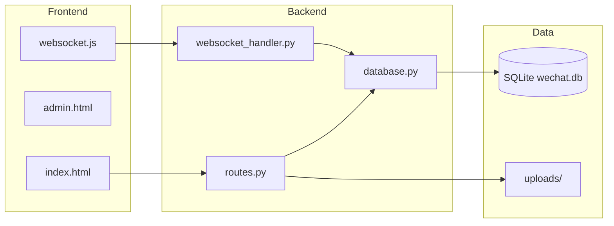
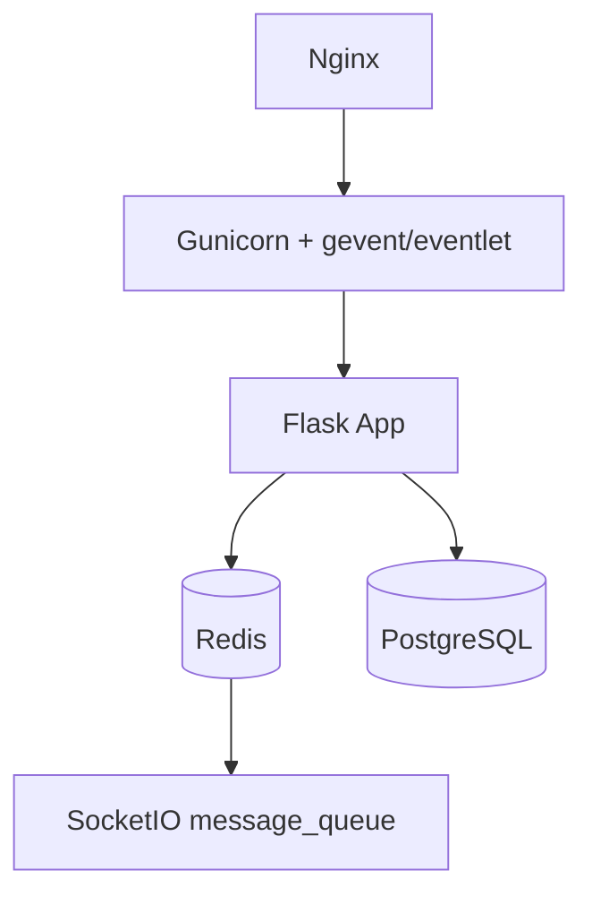
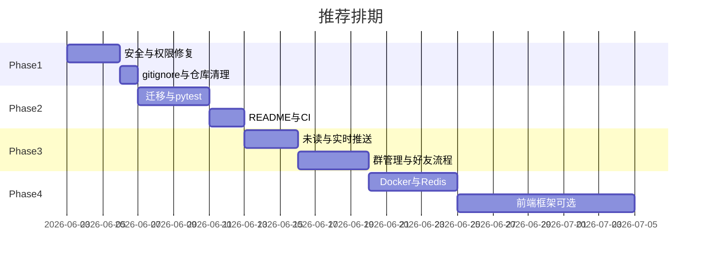

# WeChat Web 项目改进与升级路线图

## 现状摘要

项目为 **Flask + Flask-SocketIO + SQLite + 原生 JS** 的仿微信网页应用，核心能力（注册/登录、私聊/群聊、WebSocket、联系人、消息编辑/撤回、文件上传、管理后台）已实现。



主要风险与债务（审阅结论）：

| 类别 | 问题 |
|------|------|
| 安全 | [`/api/admin/*`](backend/routes.py) 无 JWT；[`admin.js`](frontend/js/admin.js) 硬编码 `admin/qwerty`；[`/api/files/<id>`](backend/routes.py) 无鉴权；多数消息/会话 API **未校验是否为会话成员** |
| 工程 | **无根目录 `.gitignore`**，仓库跟踪了 `__pycache__`、三份 `wechat.db`、[`.idea`](.idea/)、[`uploads/`](uploads/) |
| 配置 | [`config.py`](backend/config.py) 默认密钥、`CORS/SocketIO *`、`debug=True` |
| 扩展 | SocketIO `threading` + 内存 [`online_users`](backend/websocket_handler.py) 无法多进程/多实例 |
| 文档 | [`README.md`](README.md) 仅 17 行，无安装/运行说明 |

---

## 阶段一：关键修复（1–2 天，建议最先做）

### 1.1 安全与权限（最高优先级）

**管理后台**

- 后端：为 [`get_admin_stats`](backend/routes.py)、[`get_admin_users`](backend/routes.py) 增加 `@jwt_required()` + 角色校验（在 [`User`](backend/models.py) 增加 `role: user|admin`，或独立 `is_admin` 字段）。
- 前端：删除 [`admin.js`](frontend/js/admin.js) 中明文 `adminPassword: 'qwerty'`，改为调用 `/api/auth/login`（或专用 `/api/admin/login`），Token 存 `sessionStorage` 而非长期 localStorage。
- 管理页请求统一带 `Authorization: Bearer <token>`（与主应用 [`api.js`](frontend/js/api.js) 一致）。

**会话成员校验（统一中间件/装饰器）**

以下端点目前缺少「是否为 `ConversationMember`」检查，任意登录用户可读写他人会话：

- `GET/POST /api/conversations/<id>/messages`
- `POST /api/files/upload`（仅校验 `conversation_id` 存在性）
- WebSocket [`handle_send_message`](backend/websocket_handler.py)

建议新增辅助函数，例如：

```python
def require_conversation_member(user_id, conversation_id):
    member = ConversationMember.query.filter_by(...).first()
    if not member:
        abort(403)
```

在 routes 与 `handle_send_message` 中复用。

**文件访问**

- [`download_file`](backend/routes.py)：要求 JWT，并验证请求者对应该 `FileUpload.conversation_id` 的会话成员；头像路径可单独 `GET /api/files/avatar/<id>` 或绑定 user 归属。
- 上传：校验 MIME + 扩展名白名单；禁止可执行扩展名；可选病毒扫描占位。

**配置与密钥**

- 新增 [`.env.example`](backend/config.py)：`SECRET_KEY`、`JWT_SECRET_KEY`、`DATABASE_URL`、`FLASK_ENV`。
- 生产 [`ProductionConfig`](backend/config.py)：`DEBUG=False`，无默认密钥时启动失败。
- 收紧 CORS / SocketIO origins（从 `*` 改为环境变量列表）。
- JWT 过期：访问令牌缩短（如 1–7 天）+ 可选 refresh token（阶段三）。

### 1.2 仓库卫生（工程化快赢）

新增根目录 [`.gitignore`](.gitignore)：

```
__pycache__/
*.pyc
.idea/
.vscode/
*.db
instance/
uploads/*
!.gitkeep
.env
```

从 Git 移除已跟踪的敏感/生成物（`git rm --cached`），保留本地数据。统一数据库路径为 **单一** `instance/wechat.db`（与 Flask 惯例一致），删除根目录重复的 [`wechat.db`](wechat.db)、[`backend/instance/wechat.db`](backend/instance/wechat.db) 的跟踪。

重命名 [`backend/requirement.txt`](backend/requirement.txt) → `requirements.txt`，锁定版本（`pip freeze` 或 `pip-tools`）。

### 1.3 API 一致性

- 统一响应格式：`{ code, message, data }`（登录/部分路由仍混用纯 `message`）。
- 用 `logging` 替换 `print(f'... error')`（[`routes.py`](backend/routes.py) 多处）。

---

## 阶段二：工程化底座（约 3–5 天）

### 2.1 数据库迁移

- 引入 **Flask-Migrate (Alembic)**，替代手写 [`migrate_add_is_edited.py`](backend/migrate_add_is_edited.py)。
- 初始迁移包含现有表结构 + 新增字段（`User.role`、`User.is_admin` 等）。

### 2.2 自动化测试

- 使用 `pytest` + `pytest-flask`，内存 SQLite（已有 [`TestingConfig`](backend/config.py)）。
- 优先覆盖：注册/登录、会话成员权限 403、管理员 API 鉴权、消息 CRUD、文件下载权限。
- 将 [`test_api.py`](test_api.py)、[`login_check.py`](login_check.py) 收敛为 pytest 或 CI 脚本。

### 2.3 文档与本地运行

补全 [`README.md`](README.md)：

- Python 版本、虚拟环境、`pip install -r requirements.txt`
- `python backend/run.py` 或 `flask run`
- 默认账号说明、环境变量表
- 架构简图（可复用上文 mermaid）

可选：`Makefile` 或 `scripts/dev.ps1`（Windows）一键启动。

### 2.4 CI

- GitHub Actions：lint（`ruff`）、`pytest`、禁止提交 `*.db`/`__pycache__` 的简单检查。

---

## 阶段三：产品功能增强（按价值排序）

| 功能 | 现状 | 改进 |
|------|------|------|
| 未读数 | [`Conversation.to_dict`](backend/models.py) 写死 `unread: 0`；列表接口已用 `get_unread_count` | 统一由 `get_unread_count` 计算；前端会话列表展示角标 |
| 实时推送 | HTTP 发消息不广播；仅 WebSocket `send_message` 广播 | `POST .../messages` 成功后同样 `emit` 到成员 room |
| 正在输入 | 后端有 `typing` 事件 | 前端 [`app.js`](frontend/js/app.js) 绑定输入框 debounce 发送 |
| 好友流程 | 直接 `add_contact` | 可选：好友申请 / 同意 / 拒绝表 |
| 消息类型 | DB 支持 `image/file` | 前端渲染图片预览、文件卡片（已有上传 API） |
| 群管理 | [`update_group`](backend/routes.py) 空实现 | 真正更新 name/avatar；仅群主可踢人/改资料 |
| 登出 | 登录设 online | 登出 API + WebSocket disconnect 设 offline |
| 举报 | 管理后台模板有占位 | 实现 `reports` 表 + API + admin 页列表 |

### WebSocket 与在线状态

- 连接时校验成员后再 `join_room(conversation_*)`。
- 多标签页：同一 `user_id` 映射改为 `user_id -> set(sid)`，避免后连覆盖先连导致误离线。
- 心跳：前端定期 `ping`，后端 `pong`（已有 handler，需确认前端调用）。

---

## 阶段四：技术升级（可选，按部署目标选择）

### 4.1 部署与运行时



- **Docker Compose**：`web` + `postgres` + `redis` + `nginx`（静态前端 + 反代 `/api` 与 `/socket.io`）。
- SocketIO：`async_mode='eventlet'` 或 `gevent`，`message_queue=redis://...` 支持水平扩展。
- 静态资源：生产环境由 Nginx 托管 [`frontend/`](frontend/)，关闭 Flask `debug` 静态服务。

### 4.2 数据层

- 开发可保留 SQLite；生产切换 **PostgreSQL**（`DATABASE_URL`）。
- 大表索引：`messages(conversation_id, timestamp)`、`conversation_members(user_id)`。

### 4.3 前端现代化（较大改动）

- 渐进式：保持 API，用 **Vite + Vue 3** 或 **React** 重写 UI 层。
- 或保守：仅引入 **TypeScript + 模块化打包**，保留现有 DOM 逻辑。
- 环境配置：`import.meta.env.VITE_API_URL` 替代 [`websocket.js`](frontend/js/websocket.js) 硬编码 `localhost:5000`。

### 4.4 依赖升级

- Flask 2.3 → 3.x、Werkzeug、Flask-SocketIO 最新兼容矩阵（升级前跑全量 pytest）。
- 移除 [`models.py`](backend/models.py) 中未使用的 `jwt`/`wraps` 导入；WebSocket 统一用 `flask_jwt_extended.decode_token` 避免与 HS256 手工解码不一致。

---

## 建议实施顺序（均衡版）



1. **阶段一**：安全 + `.gitignore` + 成员校验（阻塞生产使用的问题）
2. **阶段二**：迁移、测试、文档、CI（保证后续改动可回归）
3. **阶段三**：未读、推送一致性、群管理、好友流程（用户体验）
4. **阶段四**：Docker/PostgreSQL/Redis/前端框架（真正上线或团队协作时）

---

## 不建议现阶段投入的方向

- 端到端加密（复杂度高，与当前架构差距大）
- 微服务拆分（单体 Flask 足够当前规模）
- 全面重写为移动端原生 App（除非产品方向变更）

---

## 关键文件索引

| 文件 | 改动类型 |
|------|----------|
| [backend/routes.py](backend/routes.py) | 鉴权、成员校验、API 统一 |
| [backend/websocket_handler.py](backend/websocket_handler.py) | 成员校验、多连接映射 |
| [backend/config.py](backend/config.py) | 环境变量、生产配置 |
| [backend/models.py](backend/models.py) | role/admin、索引 |
| [frontend/js/admin.js](frontend/js/admin.js) | 移除硬编码密码 |
| [frontend/js/api.js](frontend/js/api.js) | 管理端 Token |
| 新建 `.gitignore`、`.env.example`、`requirements.txt` | 工程化 |

确认本计划后，建议从 **阶段一（管理 API 鉴权 + 会话成员校验 + .gitignore）** 开始实施；如需我执行，可在 Agent 模式下指定「先做阶段一」或某一子项。
