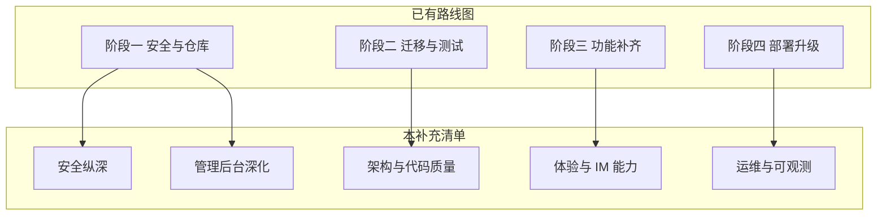

# 路线图之外的补充改进建议

现有路线图已覆盖：**安全基线、仓库卫生、迁移/测试/CI、未读/推送/群管/登出/举报、Docker/Redis/PostgreSQL**。以下内容为**未写进路线图或仅一笔带过**、但值得单独规划的事项。

---

## 与路线图的关系




建议：**先完成路线图阶段一～三**，再按业务价值从本清单挑选「阶段五」条目。

---

## 一、产品体验与 IM 能力（路线图未覆盖或很弱）


| 改进项         | 现状                                                      | 建议                                               |
| ----------- | ------------------------------------------------------- | ------------------------------------------------ |
| 1. 消息回复/引用  | 无                                                       | `reply_to_message_id` 字段 + 气泡展示引用块               |
| 消息转发        | 无                                                       | 选择消息转发到其他会话                                      |
| 会话置顶/免打扰    | 无                                                       | `ConversationMember` 增加 `pinned`、`muted`         |
| 拉黑用户        | 无                                                       | `blocks` 表；发消息/建私聊前校验                            |
| 单条已读回执      | 仅有批量 `mark-read`                                        | 展示「已读」状态（私聊双勾）                                   |
| 聊天记录搜索      | 仅搜会话名/最后一条                                              | 后端全文检索（SQLite FTS 或 PG `tsvector`）               |
| 历史消息无限滚动    | API 有 `limit/offset`，前端未见上拉加载                           | `app.js` 滚动到顶触发分页                                |
| 乐观更新        | 发消息等 HTTP 返回                                            | 先本地插入 `sending`，失败回滚                             |
| 离线消息队列      | 断线后靠刷新                                                  | reconnect 后拉取 `since=timestamp` 增量接口             |
| 图片/文件气泡     | 上传后有 `[文件]` 文本                                          | `type=file/image` 专用 UI（缩略图、下载按钮）——路线图提到渲染，可细化规范 |
| 表情/贴纸       | 无                                                       | 表情面板或 Unicode 快捷栏                                |
| 群 @提醒       | 无                                                       | 解析 `@username`，写入 `mentions` 并推送                 |
| PWA / 浏览器通知 | 无                                                       | Service Worker + `Notification API`（需 HTTPS）     |
| 深色模式        | CSS 有变量片段，`[styles.css](frontend/css/styles.css)` 存在重复块 | 统一设计 token + `prefers-color-scheme` / 手动切换       |
| 默认头像        | 依赖 `via.placeholder.com`                                | 本地 `/assets/default-avatar.svg`，避免外网依赖           |


---

## 二、安全与合规（路线图之后的「纵深」）

路线图会修管理 API、成员校验、文件鉴权；**仍未包含**：


| 改进项             | 说明                                                                                                       |
| --------------- | -------------------------------------------------------------------------------------------------------- |
| **接口限流**        | 登录/注册/搜索/上传用 Flask-Limiter 或 Redis 计数，防暴力破解与刷接口                                                          |
| **登录失败锁定**      | 连续 N 次失败临时锁定 IP 或账号                                                                                      |
| **登出吊销 Token**  | JWT 黑名单（Redis）或短期 token + refresh，避免盗用长期 token                                                           |
| **Token 存储**    | 主应用 token 在 `localStorage`（`[storage.js](frontend/js/storage.js)`），XSS 可窃取；可选 HttpOnly Cookie + CSRF 双提交 |
| **安全响应头**       | `Content-Security-Policy`、`X-Frame-Options`、`Strict-Transport-Security`（生产 HTTPS）                        |
| **密码策略**        | 强度校验、常见弱密码库；可选 bcrypt 成本参数配置                                                                             |
| **找回密码 / 邮箱验证** | 需 `email` 字段 + 邮件服务（SendGrid/SMTP）                                                                       |
| **2FA**         | `[LOGIN_CHECK_REPORT.md](LOGIN_CHECK_REPORT.md)` 已列为远期；TOTP 即可                                           |
| **账户注销与数据导出**   | GDPR 风格：`DELETE /api/users/me`、导出 JSON                                                                   |
| **上传安全深化**      | 魔数校验、图片重编码去 EXIF、病毒扫描接口占位                                                                                |
| **管理审计日志**      | `admin_audit_logs`：谁、何时、对谁执行封禁/删消息                                                                       |


---

## 三、架构与代码质量（路线图部分触及）

### 3.1 已知逻辑风险（建议尽早修）

`[create_private_conversation](backend/database.py)` 查重查询：

```python
ConversationMember.user_id.in_([user1_id, user2_id])
```

会匹配「只包含其中一人」的私聊会话，可能错误复用会话。应改为：子查询/HAVING 确保**恰好两名成员且为这两人**。

### 3.2 后端结构


| 改进项        | 说明                                                             |
| ---------- | -------------------------------------------------------------- |
| API 版本化    | `/api/v1/...`，便于后续破坏性变更                                        |
| OpenAPI 文档 | Flask-Smorest 或 flasgger，自动生成 Swagger UI                       |
| 服务层拆分      | `routes.py` 800+ 行 → `services/message_service.py` 等，路由只做参数与响应 |
| 幂等发送       | 客户端 `client_message_id`，服务端去重防双发                               |
| 软删除用户      | `users.deleted_at`，保留消息关联或匿名化                                  |
| 会话归档       | 与「删除会话」区分：`archived` 不删消息                                      |
| 未使用导入      | `[models.py](backend/models.py)` 中 `jwt`/`wraps`（路线图 4.4 已提）   |


### 3.3 前端结构


| 改进项        | 说明                                                                                |
| ---------- | --------------------------------------------------------------------------------- |
| 构建工具       | 路线图可选 Vite；即使不 React，也可用 Vite 打包多 JS 模块、树摇、环境变量                                   |
| `fetch` 超时 | `[api.js](frontend/js/api.js)` 的 `timeout` 对原生 `fetch` **无效**，需 `AbortController` |
| 全局变量       | `window.storage/api/wsManager` → ES modules 或单一 `App` 入口                          |
| CSS 去重     | `[styles.css](frontend/css/styles.css)` 后半重复（约 1670 行起），合并减少体积与冲突                 |
| 文件消息 XSS   | 文本消息已 `escapeHtml`；`type=file` 若渲染 HTML/链接需同样转义                                   |
| E2E 测试     | Playwright：登录 → 发消息 → 第二浏览器收消息                                                    |


### 3.4 仓库与杂项


| 改进项                         | 说明                                                                                                                  |
| --------------------------- | ------------------------------------------------------------------------------------------------------------------- |
| 删除 `checkhtml/.idea`        | 与主项目无关的 IDE 副本，应移出仓库                                                                                                |
| 收敛脚本                        | `[test_api.py](test_api.py)`、`[login_check.py](login_check.py)`、`[check_users.py](check_users.py)` → `scripts/` 或删除 |
| `LICENSE`、`CONTRIBUTING.md` | 开源协作基础                                                                                                              |
| pre-commit                  | ruff + 禁止 `*.db` 入仓（CI 之外的本地护栏）                                                                                     |


---

## 四、运维、可观测与可靠性（路线图 Docker 之后）


| 改进项     | 说明                                                                |
| ------- | ----------------------------------------------------------------- |
| 健康检查增强  | `/health` 增加 DB `SELECT 1`、Redis ping（若启用）                        |
| 结构化日志   | JSON 日志 + `request_id`，便于 ELK/Loki                                |
| 指标      | Prometheus：`http_requests_total`、`ws_connections`、`messages_sent` |
| 错误追踪    | Sentry 前后端 SDK                                                    |
| 备份      | SQLite `instance/wechat.db` + `uploads/` 定时备份策略文档                 |
| 上传存储抽象  | 本地目录 → S3/MinIO 适配层，为多实例部署做准备                                     |
| 依赖更新自动化 | Dependabot / Renovate                                             |


---

## 五、管理后台深化（路线图只覆盖用户列表 + 举报占位）

`[admin.html](frontend/admin.html)` 中仍为「开发中」的区块：


| 页面                   | 可新增能力                     |
| -------------------- | ------------------------- |
| 消息管理 `#messagesPage` | 按用户/会话/关键词查消息、单条删除/隐藏     |
| 系统设置 `#settingsPage` | 注册开关、上传大小、维护模式横幅          |
| 举报 `#reportsPage`    | 路线图有表设计；可加处理状态、处理人、关联消息预览 |
| 用户操作列                | 封禁、强制下线、重置密码、提升/降级 admin  |
| 仪表盘                  | 7 日活跃、消息量趋势（简单 SQL + 图表）  |


---

## 六、建议优先级（在路线图完成之后）

**P0（小改动、高收益）**

1. 修复 `create_private_conversation` 查重逻辑
2. `api.js` AbortController 超时 + 401 统一跳转登录
3. 本地默认头像，去掉 placeholder 外链
4. 接口限流（至少登录/注册）

**P1（体验明显提升）**

1. 消息历史上拉分页 + 乐观发送
2. 文件/图片消息专用 UI
3. 会话置顶/免打扰
4. 管理后台消息管理与用户封禁

**P2（中长期）**

1. 消息搜索、回复/转发、@提醒
2. OpenAPI + 服务层重构
3. PWA 通知、2FA、对象存储
4. Prometheus + Sentry

---

## 七、不建议现阶段做的（与路线图「不建议」一致）

- 端到端加密、微服务拆分、原生 App 全量重做  
- 完整微信生态（支付、小程序、视频号）  
- 大规模 ML 内容审核（可先关键词 + 人工举报流程）

---

## 总结

路线图解决的是**能否安全上线、能否持续迭代**；本补充清单解决的是**更像成熟 IM 产品、更好运维、更少隐性 bug**。若你下一步要落地，建议从 **P0 四项 + 路线图阶段一** 合并为一个 PR 批次；产品向功能从 **P1 分页与文件气泡** 开始。

如需我把其中某一类（例如「仅安全纵深」或「仅管理后台」）拆成可执行的独立实施计划，说明优先级即可。